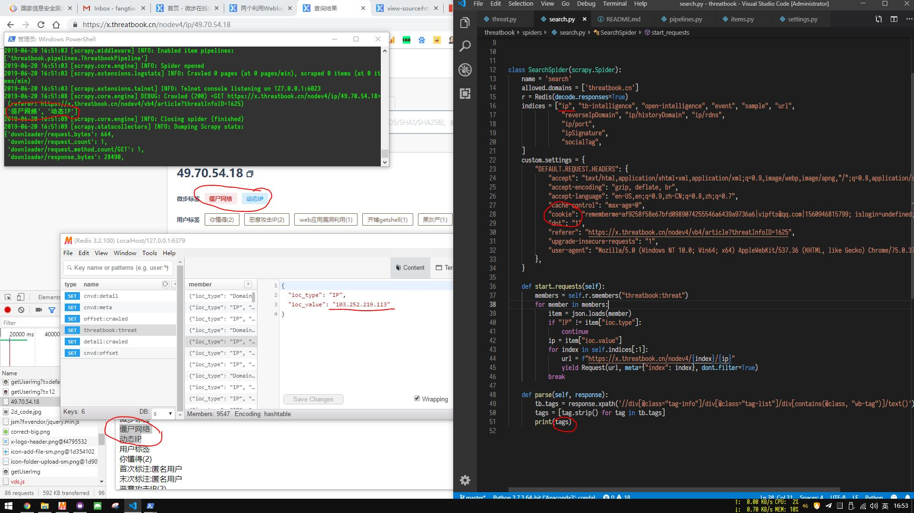

# threatbook

详细信息api
都只需要登陆get请求即可, 有cookies就行

顶部信息在https://x.threatbook.cn/nodev4/ip/113.248.158.215
html中, xpath解析即可

可批量注册用户完成用户任务获得积分, 验证码有破解服务
http://jiyandoc.c2567.com/
极验二代三代都有支持

只抓取顶部信息中的微布标签, 其他都一样, 就不一一处理了  

  

情报聚合Tab  
1, 微步情报
https://x.threatbook.cn/nodev4/tb-intelligence/113.248.158.215
2, 开源情报
https://x.threatbook.cn/nodev4/open-intelligence/113.248.158.215
3, 相关事件
https://x.threatbook.cn/nodev4/event/113.248.158.215
4, 存在通讯的样本
https://x.threatbook.cn/nodev4/sample/113.248.158.215
5, 地址上存在的url
https://x.threatbook.cn/nodev4/url/113.248.158.215

IP反查Tab
1, ip反查域名
https://x.threatbook.cn/nodev4/reverseIpDomain/113.248.158.215
2, 历史域名记录
https://x.threatbook.cn/nodev4/ip/historyDomain/113.248.158.215
3, RDNS记录
https://x.threatbook.cn/nodev4/ip/rdns/113.248.158.215

开放端口Tab
1, 端口开放信息
https://x.threatbook.cn/nodev4/ip/port/113.248.158.215

可视化Tab
无

数字签名Tab
1, SSL相关证书信息
https://x.threatbook.cn/nodev4/ipSignature/113.248.158.215

用户标签Tab
1, 用户标记
https://x.threatbook.cn/nodev4/socialTag/113.248.158.215
